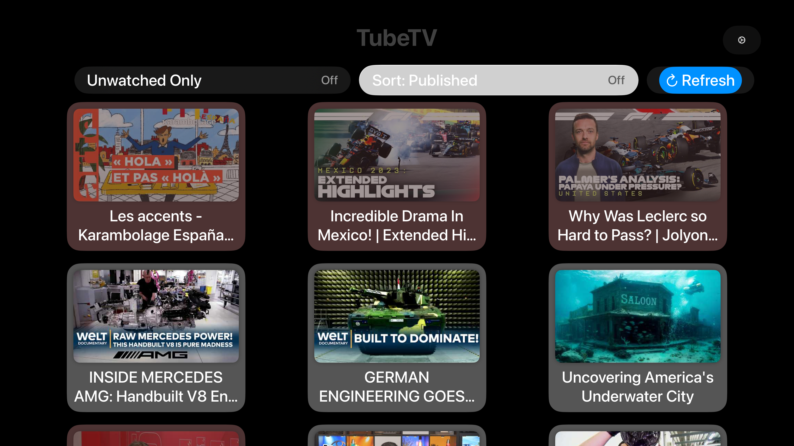
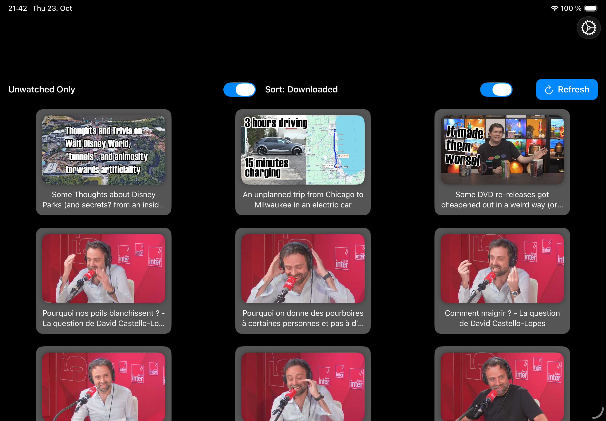
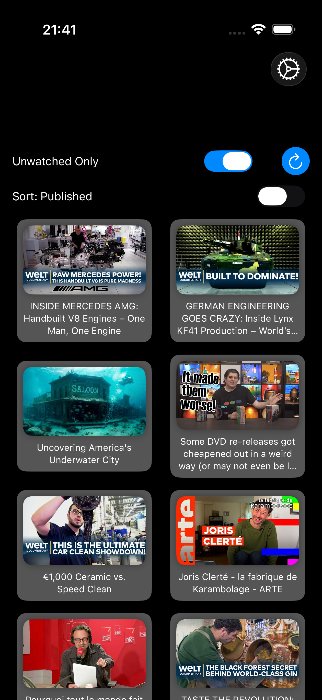

# TubeTV

A cross-platform client for [TubeArchivist](https://www.tubearchivist.com/) - your self-hosted YouTube media server. Works on both Apple TV and iPhone/iPad.

## About This Project

This is a lightweight SwiftUI app developed primarily using AI code generation to meet specific viewing needs across Apple devices. It's **not intended to be a feature-complete client** with all TubeArchivist capabilities, but rather a focused video browser optimized for both TV and mobile viewing experiences.

## Screenshots

### Apple TV

### iPad

### iPhone

## Supported Platforms

- **Apple TV (tvOS 13.0+)** - Optimized for big screen viewing with remote control
- **iPhone (iOS 13.0+)** - Compact layout for mobile browsing
- **iPad (iOS 13.0+)** - Touch-optimized interface

## Features

### Configuration
- **Settings screen** with persistent storage across all platforms
- **Connection test** to verify server and API token
- **First-run setup** automatically prompts for configuration
- **Easy access** to settings via gear icon in navigation bar

### Video Browsing
- **Retrieves all videos** from your TubeArchivist server
- **Sort toggle**: Easily switch between sorting by download date (newest downloads first) or published date
- **Continue Watching filter** - Toggle to show only videos you've started watching, sorted by progress
- **Adaptive grid layout** - 3 columns on Apple TV and iPad, 2 columns on iPhone
- **Video thumbnails** with titles, loaded from your TubeArchivist server (authenticated with your API token) and cached on device
- **Watched status indicators** - dimmed thumbnails for watched videos with overlay effects
- **Progress indicators** on in-progress videos:
  - **Progress bar**: Visual blue progress bar at bottom of thumbnail showing watch percentage
  - **Resume badge**: Orange play icon appears on videos you've partially watched
  - **Highlighted cards**: In-progress videos have a warmer background color for easy identification
- **Unwatched filter** - toggle to show only unwatched content
- **Infinite scroll** - the next page loads automatically as you approach the end of the list
- **Live updates** - after closing the player, that video's watched state and progress refresh in place (no full reload, scroll position kept)
- **Pull-to-refresh** (iPhone & iPad) - native gesture to reload the video list
- **Refresh button** (tvOS & iPad) - alternate refresh control

### Video Playback
- **Full-screen playback** with native player controls
- **Automatic resume** - Videos resume from your last watched position automatically
- **Background progress sync** - Playback position syncs to server every 15 seconds during playback
- **Playback speed control** in the system player's speed menu on all platforms (0.5×, 0.75×, 1.0×, 1.25×, 1.5×, 2.0×); the chosen speed sticks when resuming from Lock Screen controls
- **Skip controls** (Apple TV) - the system player's built-in click left/right to skip 10 seconds
- **Auto-mark as watched** - automatically updates when 10% or 30 seconds remain (whichever is longer)
- **Reliable sync**: Watched status and progress updates retry automatically if network fails

### Offline Downloads (iPhone & iPad)
- **Long-press to download** any video for offline viewing
- **Background downloads** with on-card progress indicator and percentage
- **Downloads tab** shows every video available offline (metadata and thumbnails are stored with the download, so it works without a connection)
- **Local playback** from device storage, from either tab, with automatic fallback to streaming if the file is missing
- **Offline resume**: resume position is kept locally and synced to the server when back online
- **Manage downloads** via long-press: Cancel active downloads, Delete completed ones, or Retry failed ones (marked with a red badge)
- **Storage overview** in the Downloads tab, plus bulk **Delete Watched** / **Delete All** from the ⋯ menu
- **Storage location**: Saved under `Application Support/VideoDownloads/` (excluded from iCloud backup, not purged by iOS under storage pressure). Downloads from older versions in `Caches/` are migrated automatically
- **Network**: Wi‑Fi and cellular by default; enable **Download over Wi‑Fi only** in Settings to make downloads wait for Wi‑Fi

### Podcast Mode (Background Audio, iPhone & iPad)
- **Keep listening with the screen locked** or when you switch apps
- **Lock Screen & Control Center controls**: Play/Pause and Skip ±10s
- **Now Playing metadata**: title, artwork, duration, and live progress
- **Works for both streaming and downloads**
- **AirPlay & Bluetooth** supported
- Note: tvOS remains unchanged (no background audio on Apple TV)

### Platform-Specific Features

#### Apple TV
- **Top Shelf**: "Continue Watching" and "Recently Added" rows on the Apple TV home screen; selecting one opens and plays the video
- **Remote Controls**: Click left/right to skip, Menu button to exit
- **Focus-based navigation** optimized for remote control
- **Transport bar** speed menu
- **Larger thumbnails** for big screen viewing

#### iPad
- **Optimized layout**: 3-column grid like Apple TV but sized for tablet
- **Touch controls** with horizontal control layout
- **Medium-sized thumbnails** (240×135) perfect for tablet viewing
- **Native iPad app icons** and proper interface scaling
- **Landscape and portrait** orientation support
- **Pull-to-refresh** native gesture for easy reloading
- **Enhanced card design** with modern shadows and visual polish
- **Offline downloads** via long-press with progress and management
- **Background audio** with Lock Screen controls and metadata

#### iPhone
- **Touch-optimized controls** with compact two-row layout for better usability
- **Pull-to-refresh** native gesture replaces button for streamlined interface
- **Swipe gestures** and touch interactions
- **Smaller thumbnails** optimized for mobile screens
- **Portrait and landscape** orientation support
- **Enhanced card design** with modern shadows and visual polish
- **Offline downloads** via long-press with progress and management
- **Background audio** with Lock Screen controls and metadata

## Setup

1. Clone this repository
2. Open `TubeArchivistTV.xcodeproj` in Xcode
3. Select your target device (Apple TV, iPhone, or iPad)
4. Build and run on simulator or device
5. On first launch, you'll be prompted to configure your server:
   - Enter your TubeArchivist server URL (e.g., `http://192.168.1.100:8000`)
   - Enter your API token
   - Test the connection to verify settings
   - Save settings

Settings are persisted between app sessions and can be changed anytime from the settings button (gear icon) in the navigation bar.

### Bundle identifier & App Group

Identifiers come from two project-level build settings:

- `APP_BUNDLE_IDENTIFIER` (default `edh.TubeTV`): the app is `$(APP_BUNDLE_IDENTIFIER)`, the Top Shelf extension `$(APP_BUNDLE_IDENTIFIER).TopShelf` (must be prefixed with the app's ID), tests `$(APP_BUNDLE_IDENTIFIER)Tests`
- `APP_GROUP_IDENTIFIER` (default `group.edh.TubeArchivistTV`): the App Group shared by both, used by the entitlements and the code

To use your own identifier, change `APP_BUNDLE_IDENTIFIER` under the **project's** Build Settings (not the target's "Bundle Identifier" field, which would replace the reference with a fixed value). With automatic signing, Xcode registers the App Group for your team on the first device build.

## Tests

Unit tests live in `TubeArchivistTVTests/` (Swift Testing) and cover JSON decoding, pagination, URL normalization and playback-state logic. Run them with **Product › Test** (⌘U) in Xcode.

## Requirements

- **Xcode 13.0+**
- **Apple TV**: tvOS 13.0+
- **iPhone/iPad**: iOS 13.0+
- A running [TubeArchivist](https://github.com/tubearchivist/tubearchivist) instance

## App Icons

The app includes optimized icons for all platforms:
- **iPhone**: 60x60, 120x120, 180x180 pixels
- **iPad**: 40x40, 76x76, 83.5x83.5, 152x152, 167x167 pixels
- **Apple TV**: 400x240, 1280x768 pixels
- **App Store**: 1024x1024 pixels

Add your custom app icon images to `Assets.xcassets/AppIcon.appiconset/` following the naming convention in `Contents.json`.

## Reliability & Architecture

This app prioritizes reliability through several architectural improvements:

- **Centralized Authentication**: Single source of truth for server credentials across all API requests
- **Persistent Sync Queues**: Failed watched status and progress updates are queued and retried automatically
- **Async/Await**: Modern Swift concurrency patterns prevent race conditions and memory leaks
- **Actor-based State**: Thread-safe synchronization for background progress tracking
- **Detailed Error Handling**: User-visible, actionable error messages instead of silent failures
- **Real-time Error Display**: Inline error banners and full-screen error recovery screens with retry buttons

## Limitations

This app was built to solve specific use cases and may not include features you'd expect from a full-featured client:
- No search functionality (yet)
- No channel/playlist browsing
- Basic download management only (no bulk actions, scheduling, or queue reordering)
- "Continue Watching" filtering is client-side only (scans up to 10 pages at a time for in-progress videos)

Feel free to fork and extend it for your own needs!

## Technology Stack

- **Swift** & **SwiftUI** for cross-platform UI
- **AVKit** for video playback on all platforms
- **URLSession** for API communication with centralized auth
- **Actors** for thread-safe progress sync and watched-status queuing
- **Combine** for reactive state management and error handling
- **Conditional compilation** for platform-specific optimizations, with per-device sizing centralized in `Layout.swift`
- **TVServices** Top Shelf extension sharing model code with the app
- **UserDefaults** for persistent retry queues and configuration
- Developed with heavy assistance from AI code generation tools

## License

This project is licensed under the MIT License - see the [LICENSE](LICENSE) file for details.

## Acknowledgments

- [TubeArchivist](https://github.com/tubearchivist/tubearchivist) - The amazing self-hosted YouTube archiving solution
- AI coding assistants for helping build this quickly
